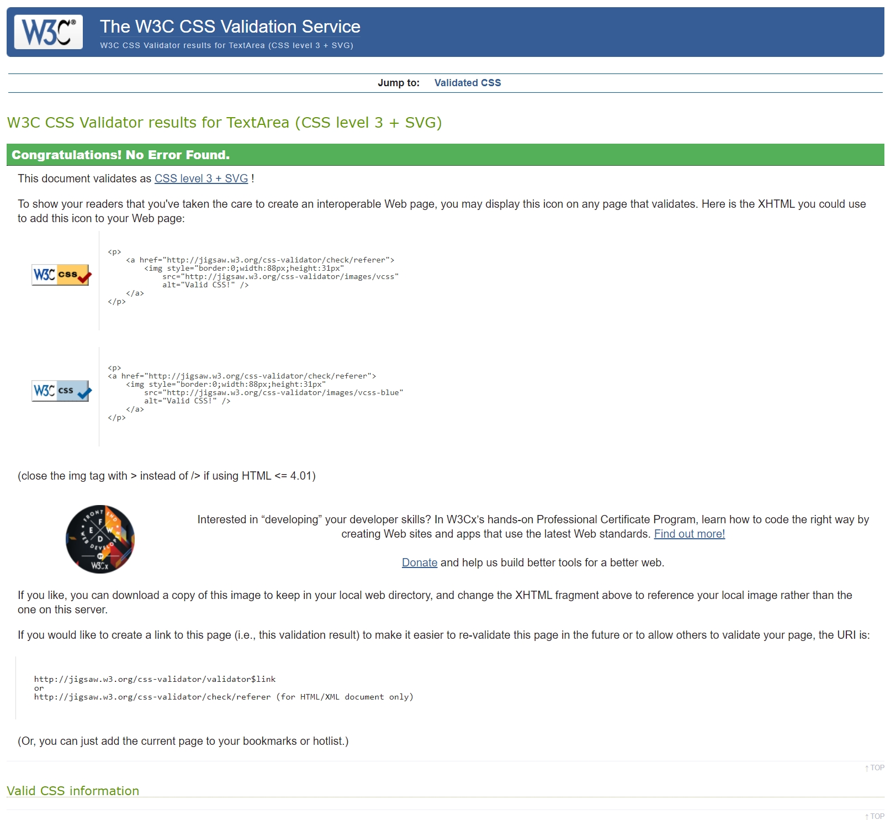
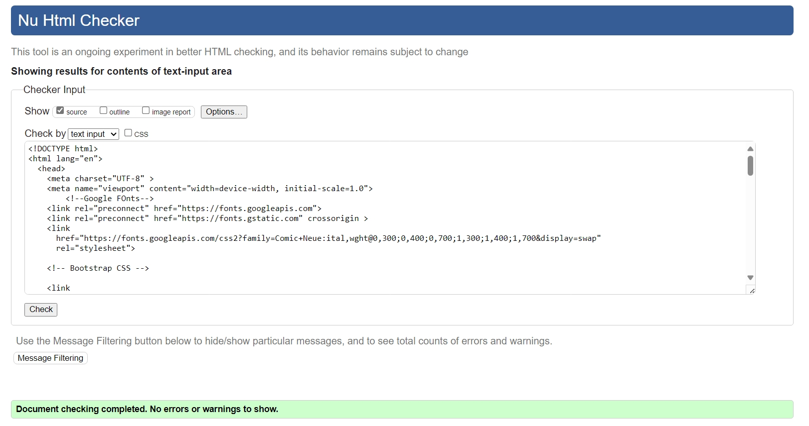

# Math-Word-Match-Game

# 📌 Matching Word & Number Game  

## 📝 Project Objectives  
This project is an **interactive learning game** that helps users match numbers (1-20) with their word forms. The game aims to:  

- Provide a **fun and engaging way** to reinforce number-word recognition.  
- Ensure a **responsive, accessible, and user-friendly design**.  
- Implement **core JavaScript functionality** to track matches and provide feedback.  
- Offer a **smooth user experience** with visual feedback and a scoring system.  
- Deploy the game on **GitHub Pages** with clean, validated code.  

---

## 📖 User Stories  

### 🟢 User Story 1: As a player, I want to match numbers with their word forms  
**✅ Acceptance Criteria:**  
- The game displays numbers (1-10) and their word equivalents in a **randomized grid**.  
- When a player clicks two elements, the game checks if they match.  
- Correct matches turn **green** and stay visible.  
- Incorrect matches turn **red** and disappear after 1 second.  

**🛠 Tasks:**  
- Create HTML structure for number and word cards.  
- Write JavaScript to handle matching logic.  
- Implement visual feedback for correct/incorrect matches.  

---

### 🟢 User Story 2: As a player, I want to track my score  
**✅ Acceptance Criteria:**  
- A score counter updates when a match is made.  
- The final score is displayed when all matches are completed.  
- A "Play Again" button resets the score and reshuffles cards.  

**🛠 Tasks:**  
- Add a score-tracking variable.  
- Display score in the UI.  
- Implement a game reset function.  

---

### 🟢 User Story 3: As a player, I want to play the game on mobile and desktop  
**✅ Acceptance Criteria:**  
- The game adapts to different screen sizes.  
- Buttons are large enough for easy tapping on mobile.  
- The layout remains **clear and responsive** on all devices.  

**🛠 Tasks:**  
- Use **CSS Flexbox/Grid** for a responsive layout.  
- Add **media queries** for mobile optimization.  
- Test on different devices/browsers.  

---

### 🟢 User Story 4: As a player, I want the game to provide clear instructions  
**✅ Acceptance Criteria:**  
- A brief **"How to Play"** section is displayed.  
- Instructions are clear and concise.  
- Instructions remain visible or accessible at all times.  

**🛠 Tasks:**  
- Write instructional text.  
- Style instructions for readability.  
- Ensure accessibility (e.g., screen readers can read the instructions).  

---

## 🎯 MoSCoW Prioritization  

### ✅ Must-Have (Critical for MVP)  
- Matching functionality for numbers & words.  
- Score tracking & game completion feedback.  
- A "Restart" button that resets the game.  
- Responsive design for mobile & desktop.  
- Basic accessibility (keyboard navigation, color contrast).  
- No critical bugs (game must be playable without crashes).  

### 🟡 Should-Have (Important but not MVP-blocking)  
- A timer that tracks completion time.  
- Sound effects for correct/incorrect matches.  
- Progress indicators (e.g., how many pairs remain).  
- Additional accessibility features (screen reader enhancements).  

### 🔵 Could-Have (Bonus Features if Time Allows)  
- Dark mode toggle for better readability.  
- Customizable difficulty (e.g., different number ranges).  
- Animations for smoother transitions.  
- Themed designs (e.g., fun fonts & styles).  

## 📁 Folder Structure

Math-Word-Match-Game/
├── index.html
├── README.md
└── assets/
├── css/
│ └── style.css
├── js/
│ └── script.js
└── screenshots/
---
## 🛠 Technologies Used  
- HTML5  
- CSS3  
- JavaScript (ES6)  
- Git & GitHub Pages  

## 🛠️ Testing & Bug Fixes  

### 🐞 Issue 1: SweetAlert Popup Moved Game Buttons  
- The popup caused buttons to shift or disappear.  
- `position: "center"` affected layout.  
- ✅ Changed to `"top"` to prevent interference.  

### 🐞 Issue 2: Score Button Was Below Start Button  
- Score button stacked incorrectly under Start.  
- Inspected with a red border and found grid issues.  
- ✅ Fixed Bootstrap layout to align buttons side by side.  

### 🐞 Issue 3: Styling Lost After HTML Changes  
- Bootstrap styles disappeared after modifying HTML.  
- Checked CSS file order and Bootstrap integration.  
- ✅ Reapplied Bootstrap CDN and reordered styles.  

### 🐞 Issue 4: Button Colors & Borders Not Matching  
- Start and Score buttons had different colors/borders.  
- Used DevTools to find Bootstrap overrides.  
- ✅ Applied `!important` in CSS and removed borders.  

### 🐞 Issue 5: Score Not Resetting on Restart  
- Score increased correctly but didn't reset to `0`.  
- Confirmed issue by clicking Start multiple times.  
- ✅ Updated `resetGame(true)` to reset the score.  

### 🐞 Issue 6: Numbers Not Shuffling on Reset (Fixed)  
- Number and word buttons stay in the same order.  
- Need to correctly shuffle on game reset.  
- Fixed
## Final testing

# 🛠 JavaScript Testing  
### **Tool Used:** [JSHint](https://jshint.com/)  
- **Test Date:** **9 March 2023**  
- **Tested File(s):** `script.js`  
- **Purpose:** Ensure there are no syntax errors, unused variables, or bad practices.  
- **Result:** _()_  
## 📱 Responsive Testing  
Tested on:  
- Chrome Desktop  
- Firefox Desktop  
- iPhone (Safari)  
- Nest Hub 1024x600 — fixed scrolling issue  

---

## 🎨 CSS Testing  
### **Tool Used:** [W3C CSS Validator](https://jigsaw.w3.org/css-validator/)  
- **Test Date:** **9 March 2023**  
- **Tested File(s):** `styles.css`  
- **Purpose:** Validate CSS for syntax errors and compatibility issues.  
- **Result:** No errors 
---

## 🏗 HTML Validation  
### **Tool Used:** [W3C Markup Validator](https://validator.w3.org/)  
- **Test Date:** **9 March 2023**  
- **Tested File(s):** `index.html`  
- **Purpose:** Ensure semantic correctness and accessibility compliance.  
- **Result:** No errors 

---

## 🚀 Performance Testing (Lighthouse Report)  
### **Tool Used:** [Google Lighthouse](https://developers.google.com/web/tools/lighthouse)  
- **Test Date:** **9 March 2023**  
- **Pages Tested:**  
  - 🏠 **Homepage (`index.html`)**  
  

### **Lighthouse Metrics:**  
| **Category**  | **Score** (0-100) |
|--------------|-----------------|
| **Performance**  | _(99)_  |
| **Accessibility**  | _(100)_  |
| **Best Practices**  | _(100)_  |
| **SEO**  | _(90)_  |

## ✅ Screen Reader Accessibility Test  
**Tested with:** Windows Narrator  
**Result:** All buttons, labels, and interactive elements were read correctly.  
**Fixes Needed:** None – ARIA labels and navigation work as expected.  
---

To run locally:  
1️⃣ Clone the repository  
2️⃣ Open `index.html` in browser or run with Live Server
3️⃣ **Deployment**  
👉
The game is deployed on [GitHub Pages](https://github.com/HelenLloydJeng/Math-Word-Match-Game)  

## 🎓 Credits & Resources  

### 🙌 Special Thanks  
A huge **thank you** to my mentor **Richard Wells** for his guidance, support, and invaluable feedback throughout this project.  

### 📚 Learning Resources  
Throughout this project, I referred to the following resources to improve my understanding of **JavaScript, HTML, CSS, and UI design**:  

- [W3C Schools](https://www.w3schools.com/) – General **HTML, CSS, and JavaScript** lessons.  
- [MDN Web Docs](https://developer.mozilla.org/) – In-depth **JavaScript** documentation.  
- [JavaScript.info](https://javascript.info/) – Advanced JavaScript concepts and tutorials.  
- [Slack Community](https://slack.com/) – Peer discussions and troubleshooting help.  

### 🛠 Tools & Libraries Used  
- [SweetAlert2](https://sweetalert2.github.io/) – Custom **pop-up alerts** for game interactions.  
- [Bootstrap](https://getbootstrap.com/) – Responsive **button styling** and layout design.  
- [Google Fonts](https://fonts.google.com/) – **Comic Neue** font for a playful UI.  
- [CSS Keyframes & Media Queries](https://developer.mozilla.org/en-US/docs/Web/CSS) – Used for **animations and responsiveness**.  

