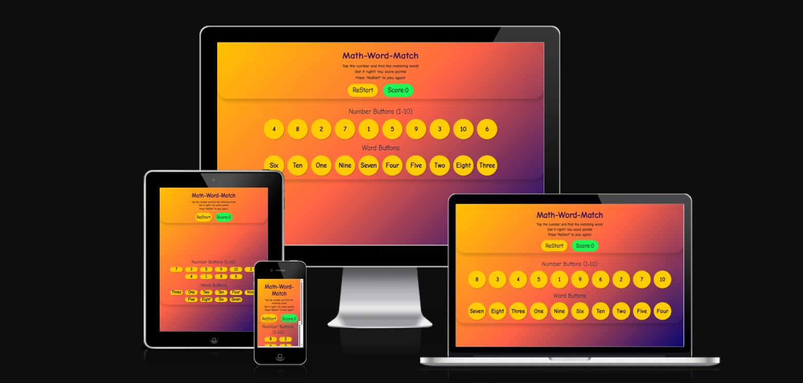
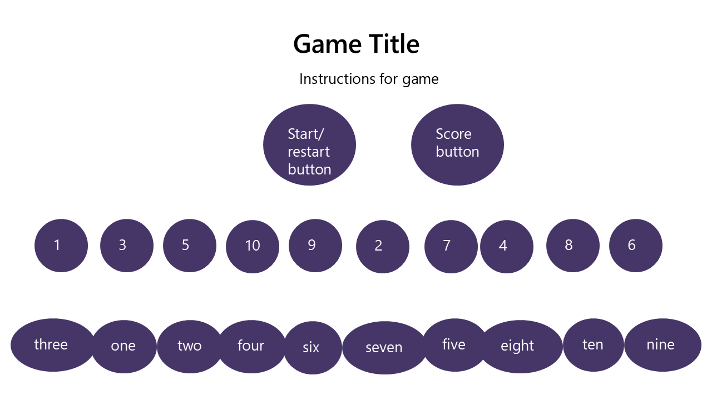
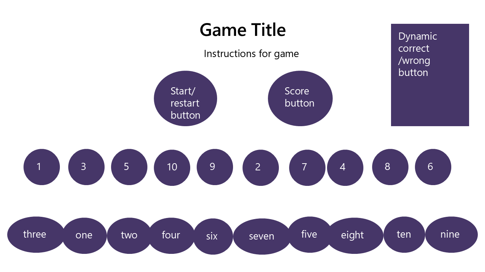
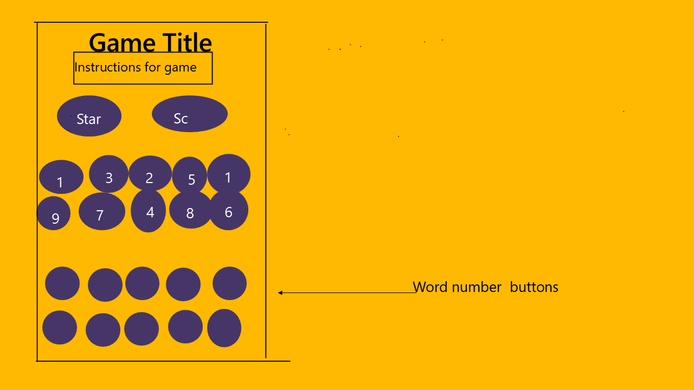
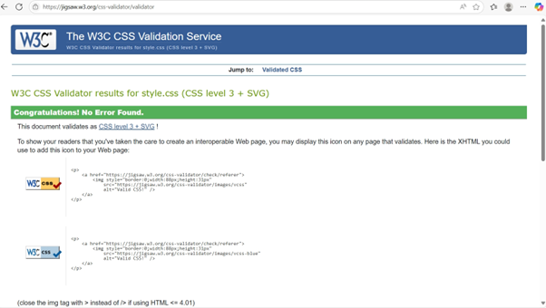
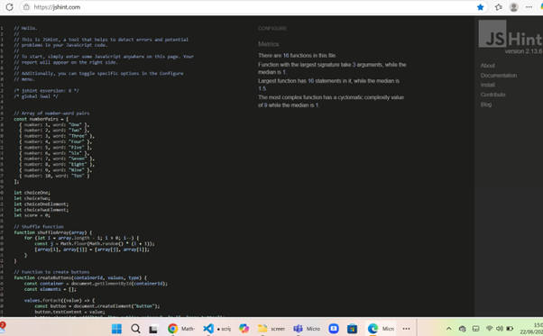

# Math-Word-Match-Game

# 📌 Matching Word & Number Game  




## 📝 Project Objectives  
This project is an **interactive learning game** that helps users match numbers (1-10) with their word forms. The game aims to:  

- Provide a **fun and engaging way** to reinforce number-word recognition.  
- Ensure a **responsive, accessible, and user-friendly design**.  
- Implement **core JavaScript functionality** to track matches and provide feedback.  
- Offer a **smooth user experience** with visual feedback and a scoring system.  
- Deploy the game on **GitHub Pages** with clean, validated code.  

---

## 📖 User Stories  

### 🟢 User Story 1: As a player, I want to match numbers with their word forms  
**✅ Acceptance Criteria:**  
- The game displays numbers (1-10) and their word equivalents in a **randomized grid**.  
- When a player clicks two elements, the game checks if they match.  
- Correct matches turn **green** and stay visible.  
- Incorrect matches turn **red** and disappear after 1 second.  

**🛠 Tasks:**  
- Create HTML structure for number and word cards.  
- Write JavaScript to handle matching logic.  
- Implement visual feedback for correct/incorrect matches.  

---

### 🟢 User Story 2: As a player, I want to track my score  
**✅ Acceptance Criteria:**  
- A score counter updates when a match is made.  
- The final score is displayed when all matches are completed.  
- A "Play Again" button resets the score and reshuffles cards.  

**🛠 Tasks:**  
- Add a score-tracking variable.  
- Display score in the UI.  
- Implement a game reset function.  

---

### 🟢 User Story 3: As a player, I want to play the game on mobile and desktop  
**✅ Acceptance Criteria:**  
- The game adapts to different screen sizes.  
- Buttons are large enough for easy tapping on mobile.  
- The layout remains **clear and responsive** on all devices.  

**🛠 Tasks:**  
- Use **CSS Flexbox/Grid** for a responsive layout.  
- Add **media queries** for mobile optimization.  
- Test on different devices/browsers.  

---

### 🟢 User Story 4: As a player, I want the game to provide clear instructions  
**✅ Acceptance Criteria:**  
- A brief **"How to Play"** section is displayed.  
- Instructions are clear and concise.  
- Instructions remain visible or accessible at all times.  

**🛠 Tasks:**  
- Write instructional text.  
- Style instructions for readability.  
- Ensure accessibility (e.g., screen readers can read the instructions).  

---

## 🎯 MoSCoW Prioritization  

### ✅ Must-Have (Critical for MVP)  
- Matching functionality for numbers & words.  
- Score tracking & game completion feedback.  
- A "Restart" button that resets the game.  
- Responsive design for mobile & desktop.  
- Basic accessibility (keyboard navigation, color contrast).  
- No critical bugs (game must be playable without crashes).  

### 🟡 Should-Have (Important but not MVP-blocking)  
- A timer that tracks completion time.  
- Sound effects for correct/incorrect matches.  
- Progress indicators (e.g., how many pairs remain).  
- Additional accessibility features (screen reader enhancements).  

### 🔵 Could-Have (Bonus Features if Time Allows)  
- Dark mode toggle for better readability.  
- Customizable difficulty (e.g., different number ranges).  
- Animations for smoother transitions.  
- Themed designs (e.g., fun fonts & styles). 

## 🔭 Future Enhancements
- Difficulty levels (e.g., 1–20, 1–100)
- Sound effects toggle
- Dark mode


## 🗺 Wireframes & Mockups





## 📁 Folder Structure
```text
Math-Word-Match-Game/
├── index.html
├── README.md
└── assets/
    ├── css/
    │   └── style.css
    ├── js/
    │   └── script.js
    └── screenshots/
        ├── game-screenshot.png
        ├── jshint-report.png
        ├── validator.w3.css.png
        ├── validator.w3.html.png
        ├── desktop.PNG
        ├── mobile.PNG
        └── wireframe2.PNG
```
---
## 🛠 Technologies Used
- HTML5  
- CSS3  
- JavaScript (ES6)  
- Git & GitHub Pages  

---

## 🛠️ Testing & Bug Fixes

### 🐞 Key Issues Fixed
- **SweetAlert popup moved game buttons** → changed position to `"top"`.
- **Score button stacking under Start** → fixed Bootstrap layout.
- **Lost styles after HTML edits** → reapplied Bootstrap CDN in correct order.
- **Button colors & borders inconsistent** → unified via CSS overrides.
- **Score not resetting on Restart** → updated `resetGame(true)`.
- **Numbers not shuffling** → corrected shuffle logic and button data mapping.

---

## ✅ Structured Testing

### 1) Functional Testing
| Feature | Test | Expected | Result |
|---|---|---|---|
| Match logic | Click number + matching word | Success modal; score +1 | Pass |
| Wrong pair | Click mismatched pair | Error modal; selections reset | Pass |
| Restart | Click **ReStart** | Score resets to 0; reshuffle | Pass |
| Accessibility | Keyboard navigation | Focus visible; Enter/Space works | Pass |

### 2) UI/UX + Responsiveness
- Devices: Chrome Desktop, Firefox Desktop, iPhone (Safari), **Nest Hub 1024×600**  
- Nest Hub fix: **full-width sticky header** + **vertical scroll in game area**; **buttons resized** to fit one row.
- Screenshots:  
  - `assets/screenshots/desktop.PNG`  
  - `assets/screenshots/mobile.PNG`  
  - `assets/screenshots/wireframe2.PNG`

### 3) Validation
- **HTML:** ✔ No errors  
  
- **CSS:** ✔ No errors  
  
- **JavaScript (JSHint):** ✔ No critical issues  
  

### 4) Performance (Lighthouse)
**Desktop**
| Category | Score |
|---|---|
| Performance | 99 |
| Accessibility | 100 |
| Best Practices | 100 |
| SEO | 90 |

**Mobile**
| Category | Score |
|---|---|
| Performance | 80–89 |
| Accessibility | 100 |
| Best Practices | 100 |
| SEO | 90 |

_Note:_ Mobile variation caused by external CDNs (Bootstrap & SweetAlert2) and extensions; tested again in Incognito.

---

## 🔧 Recent Fixes and Improvements
- **Nest Hub 1024×600:** header set to `container-fluid` and sticky; game area scrolls vertically; removed top gap/overlap.  
- **Buttons:** reduced size/margins so all **10 fit on one row**; optional horizontal scroll fallback on very small widths.  
- **Modals:** consistent centering; prevented layout shift.  
- **Structure:** moved assets to `assets/css`, `assets/js`, `assets/screenshots`.  
- **Polish:** fixed Google Fonts URL; removed stray margins; cleaned selectors.

---

## 🚀 Deployment

### GitHub Pages
- **Repository:** https://github.com/HelenLloydJeng/Math-Word-Match-Game  
- **Live Site:** https://helenlloydjeng.github.io/Math-Word-Match-Game/

**Steps to deploy:**
1. Push changes to the `main` branch.
2. In GitHub, open **Settings → Pages**.
3. Under **Branch**, choose `main` and `/ (root)`, then **Save**.
4. Wait for Pages to build; the site appears at the Live Site URL.

### Run Locally
```bash
git clone https://github.com/HelenLloydJeng/Math-Word-Match-Game.git
cd Math-Word-Match-Game
python -m http.server 5500
# then open http://localhost:5500
```

## 🎓 Credits & Resources  

### 🙌 Special Thanks  

- **Richard Wells** (mentor) — for guidance, support, and feedback  
- **ChatGPT and CoPilot** (OpenAI) — for code review assistance, bug fixing, testing advice, and README editing  
- Fellow students on **Code Institute Slack Community** — for advice and encouragement  

---

### 📚 Learning Resources  

- [W3Schools](https://www.w3schools.com/) — General HTML, CSS, JavaScript  
- [Code Institute Tutorials](https://learn.codeinstitute.net/ci_program/diwad_v2_9)
- [MDN Web Docs](https://developer.mozilla.org/) — Advanced JavaScript, HTML, CSS  
- [JavaScript.info](https://javascript.info/) — In-depth JavaScript tutorials  
- [Slack Community](https://slack.com/) — Peer discussions and troubleshooting  
- [ChatGPT (OpenAI)](https://chat.openai.com/) — for additional learning support  

---

### 🛠 Tools & Libraries Used  

- [SweetAlert2](https://sweetalert2.github.io/) — Custom pop-up alerts  
- [Bootstrap](https://getbootstrap.com/) — Responsive styling and layout  
- [Google Fonts](https://fonts.google.com/) — Comic Neue font  
- [CSS Keyframes & Media Queries](https://developer.mozilla.org/en-US/docs/Web/CSS) — For animations and responsiveness  
- [Git & GitHub](https://github.com/) — Version control and deployment  

---

_This project was created as part of the **Diploma in Full Stack Software Development** with **Code Institute**._

 


